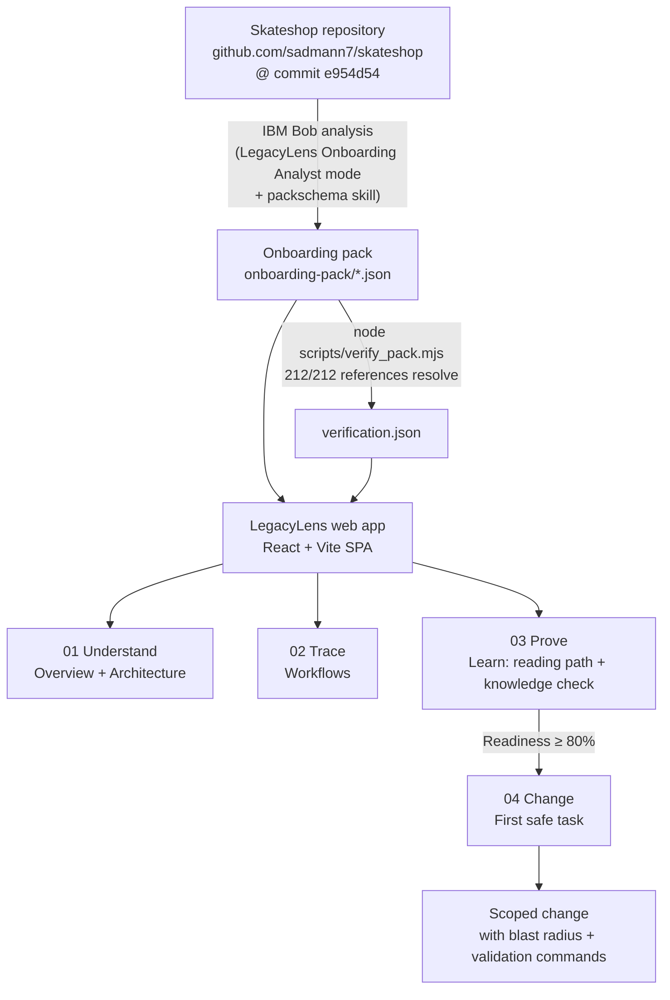
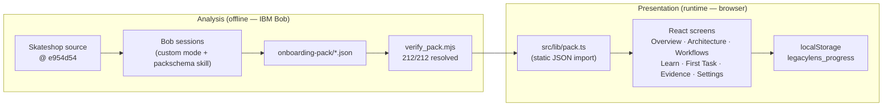

# LegacyLens

> **Turn IBM Bob repository analysis into a verified onboarding experience — so a developer can understand a legacy codebase and prepare a safer first contribution.**

LegacyLens is a React + Vite single-page app that renders a structured, evidence-backed **onboarding pack** for an unfamiliar codebase. IBM Bob analyses the target repository and writes the pack as a set of JSON files. A verification script checks every file and line citation against the analysed commit, and LegacyLens turns the verified pack into a guided journey with four phases: **Understand → Trace → Prove → Change**. Every claim in the UI opens the source files and line ranges that support it, as GitHub permalinks pinned to the analysed commit.

The target repository for this hackathon is [**skateshop**](https://github.com/sadmann7/skateshop), an open-source Next.js 14 e-commerce platform, pinned to commit [`e954d54`](https://github.com/sadmann7/skateshop/tree/e954d54379a7a6f798d3f49ffc6664449220adfc).

---

## Table of Contents

1. [The Problem](#1-the-problem)
2. [The Solution](#2-the-solution)
3. [System Architecture](#3-system-architecture)
4. [Core User Journey](#4-core-user-journey)
5. [Readiness Model](#5-readiness-model)
6. [The Verified Onboarding Pack](#6-the-verified-onboarding-pack)
7. [How IBM Bob Was Used](#7-how-ibm-bob-was-used)
8. [Safe Contribution Case Study](#8-safe-contribution-case-study)
9. [Validation Strategy](#9-validation-strategy)
10. [Running LegacyLens](#10-running-legacylens)
11. [Project Structure](#11-project-structure)
12. [Known Limitations](#12-known-limitations)
13. [License](#13-license)

---

## 1. The Problem

Onboarding onto an unfamiliar or legacy codebase is slow and risky:

- **Stale or incomplete documentation.** READMEs describe what a project was, not what it is. Skateshop's own README, for example, says the database is on PlanetScale, but the source code uses PostgreSQL.
- **No verified entry point.** Knowing that a file *exists* is not the same as knowing *what it does*, *who calls it*, or *what breaks if you change it*.
- **AI explanations are unverified.** A language model can describe a codebase fluently while citing paths that do not exist, line numbers that have moved, or patterns that were refactored away.
- **Blast radius is invisible.** A new contributor choosing a first task rarely knows which layers a change touches, which services are involved, or what validation is actually required.
- **Readiness is opaque.** Nothing signals when a developer has learned enough to make a change safely, so the decision comes down to intuition instead of evidence.

---

## 2. The Solution

LegacyLens addresses each problem with a structured, evidence-gated workflow:



**Key design principle:** LegacyLens does not analyse Skateshop at runtime. Bob produces the onboarding pack offline and `verify_pack.mjs` checks it. LegacyLens bundles the verified pack at build time and only renders it, so every citation the UI shows was checked against the analysed commit before the app was built.

---

## 3. System Architecture

### Components

| Component | Role |
|-----------|------|
| **Skateshop** (`github.com/sadmann7/skateshop`) | Target legacy repository, pinned to commit `e954d54379a7a6f798d3f49ffc6664449220adfc`. |
| **IBM Bob** | AI assistant used to analyse Skateshop, author the pack JSON, build parts of the UI, and validate and review a real change. |
| **"LegacyLens Onboarding Analyst" custom mode + `packschema` skill** | Workspace-scoped Bob mode and skill that live in the Skateshop working copy (`.bob/custom_modes.yaml`, `.bob/skills/packschema/SKILL.md`). The skill defines the pack schema, and generation sessions used it to keep every file consistent. They are not committed to this repository; see the screenshots in [`bob_sessions/member1/`](bob_sessions/member1/). |
| **`onboarding-pack/*.json`** | The contract between analysis and presentation: six content files plus `verification.json`. |
| **`scripts/verify_pack.mjs`** | Node script that validates the pack schema and cross-references, then resolves every cited path and line range against the pinned commit in a local Skateshop clone. It writes `verification.json`. |
| **LegacyLens SPA** (`src/`) | React 18 + Vite 6 + TypeScript. `src/lib/pack.ts` statically imports the pack JSON, so the app makes no network requests at runtime (only outbound GitHub permalinks and Google Fonts). |
| **`src/lib/readiness.ts`** | Pure, rule-based readiness scoring and knowledge-gap computation (no AI), plus `localStorage` persistence helpers. |
| **`src/lib/progress.tsx`** | React context and reducer for learner progress, journey milestones, and the first-task checklist. Persists through `readiness.ts`. |
| **`src/lib/evidence.ts`** | Builds GitHub permalinks pinned to the analysed commit, reads `verification.json` to mark citations verified, derives confidence levels, and indexes every evidence-backed claim and cited file. |
| **`src/lib/router.ts`** | Minimal hash router with deep links (for example `#/workflows/checkout_payment/3`). |
| **`bob_sessions/`** | Screenshots of the Bob sessions, one folder per team member (M1–M5). |
| **`evidence/validation/`** | Pack-verification and fix-proof screenshots. The other `evidence/` subfolders (`benchmark`, `git`, `ui`, `video`) are empty placeholders. |

### Separation of concerns



---

## 4. Core User Journey

LegacyLens opens on a **repository selection screen** where the user pastes a GitHub repository URL. The app validates and normalises the URL (trailing `/` and `.git` are stripped). For the current demo, only the verified Skateshop repository is supported — entering any other URL shows an honest "analysis unavailable" state rather than Skateshop data. Repository selection is centralised in `src/lib/repository.ts`; no repository-specific checks are scattered through the onboarding screens.

Once the supported Skateshop URL is entered, a short transition (checking URL → loading pack → verifying data → preparing journey) leads into the hash-routed onboarding experience described below. An **"Analyze another repository"** link in the sidebar returns to the selection screen at any time without resetting the onboarding progress.

The app is a hash-routed SPA with seven screens: five **Investigation** screens (Overview, Architecture, Workflows, Learn, First Task) and two utility screens (Evidence, Settings). The sidebar shows each screen's milestone status. The top bar shows the live readiness score ("N% understood") and a search button.

The journey is tracked as **six milestones across four phases**:

| Phase | Milestone | Done when |
|-------|-----------|-----------|
| 01 Understand | Repository orientation | Always done (opening the app) |
| 01 Understand | Architecture map | All 6 layers inspected |
| 02 Trace | Critical workflows | All 5 required workflows marked traced |
| 03 Prove | Reading path | All 6 required reading steps reviewed |
| 03 Prove | Knowledge check | All 10 questions answered correctly |
| 04 Change | First safe task | Readiness ≥ 80% **and** every checklist item ticked |

### Overview (`#/overview`)

The entry screen orients the developer. It shows:

- **Repository card:** repo name, licence, one-line description, source URL, and the short commit hash (`e954d54`) the pack was analysed at.
- **Journey phases:** the four phases and their milestones, with live status (done / now / locked).
- **Mission card:** the next recommended action (for example, the next uninspected layer or the next untraced workflow). It updates as progress changes.
- **"Why trust this?" panel:** the verification result (`212/212 citations resolved at commit e954d54`), the date it was checked, the count of observed vs inferred claims, and a link to the Evidence ledger. It also says plainly that nothing in the pack was executed by the app.
- **"What the README won't tell you":** the 5 key facts from `overview.json`: the stale PlanetScale reference, the Stripe Checkout box left unchecked despite a checkout flow in source, the `next.config.js` settings that skip lint and type errors during builds, the missing test suite, and the 13-table DB schema.
- **Where execution starts:** the 4 entry points, with file references.
- **Stack at a glance:** 10 stack items. Clicking one opens the evidence panel with its source citations.

### Architecture (`#/architecture/<layerId>`)

An interactive, hand-laid-out SVG graph of Skateshop's six layers and the 8 dependency edges between them (all marked `observed` in the pack):

- **Layers:** UI / Routes, Server Actions, Data Layer, Auth, External Services, Content.
- **Node selection:** clicking a layer highlights its edges with an animated connector, dims unrelated nodes, and opens a detail panel.
- **Detail panel:** summary ("What we found"), incoming and outgoing relationships ("Why we think this") with evidence buttons, the first two code citations, related paths, and "View all evidence".
- **Confidence badges:** these are not stored in the pack. `confidenceOf()` in `src/lib/evidence.ts` derives them: **high** for an observed claim with at least one verified citation, **medium** for an inferred claim with verified citations, **low** when no citation is verified.
- **Inspection tracking:** each opened layer is saved to progress, and the header shows `N/6 layers inspected`.
- **All relationships table:** every edge, listed with its basis and evidence.

> `architecture.json` also contains a Mermaid graph string. The current UI does not render it; the graph is drawn with custom SVG.

### Workflows (`#/workflows/<workflowId>/<step>`)

Five step-by-step traces of the critical journeys, ordered foundations first:

| Workflow | Actor | Steps | External services | Needs secrets to run |
|----------|-------|------:|-------------------|:--------------------:|
| Data Layer (DB Client & Schema) | Developer | 6 | PostgreSQL | Yes |
| Authentication & Route Protection | Visitor | 4 | Clerk | Yes |
| Add to Cart | Visitor | 9 | — | No |
| Checkout & Payment | Customer | 8 | Stripe | Yes |
| Seller Product Management | Seller | 9 | Uploadthing, Stripe | Yes |

Each step shows the files involved, the workflow's external dependencies, its code citations, and a confidence badge. Use ↑/↓ to move between steps. Workflows that need secrets show a risk note advising the developer to read them rather than run them on day one.

A workflow only counts as traced after the developer **visits every step** and then clicks **"Mark workflow traced"**. Traced status can be undone.

### Learn (`#/learn/<stepId>`)

A readiness strip at the top, with the reading path and the knowledge check side by side below it.

**Readiness strip**
- A progress ring for the weighted total, with the 80% threshold marked.
- Three bars with their weights: Reading path ×0.3, Knowledge check ×0.5, Workflows traced ×0.2.
- An "Open first task" button once the score reaches the threshold.

**Reading path**
- 9 steps ordered so each makes the next easier: **6 required (~115 min)** and **3 optional (40 min)**, 155 min in total.
- Each step expands to show its rationale, the files to read in order (as permalinks), the linked workflows, and a "Mark as reviewed" button.
- A step linked to a wrongly answered question is tagged `GAP · REVIEW TO RETRY`.

**Knowledge check**
- 10 multiple-choice questions with 4 options each, covering all five workflows: auth 2, add_to_cart 2, checkout_payment 2, seller_product 1, data_layer 3.
- **Correct answer:** shows the explanation and its code citations, plus a score delta (`Understanding N% → M%`) when the total changes.
- **Wrong answer:** shows which reading step covers the topic. The answer is not revealed. **Retry question** unlocks only after that reading step is marked reviewed.

### First Task (`#/task`)

The recommended task is **"Fix 'Bytest' typo in formatBytes fallback label"** (`fix-formatbytes-typo`) in Skateshop's `src/lib/utils.ts`: the fallback unit label `"Bytest"` should be `"Bytes"`.

Until readiness reaches 80%, the screen shows a **locked gate** instead of the task. The gate lists what is left (unreviewed required steps, questions not yet answered correctly, untraced workflows) and notes that any mix reaching 80% unlocks the task. **"Preview the task anyway"** shows the task in read-only form (the checklist stays disabled).

Once unlocked, the screen shows:

- **Task card:** title, rationale, risk badge (`low`), the file to change, and a "Why this task?" checklist: 1 file to change, low risk after comparing 4 candidates, no external services, 3 CI checks, part of the Data Layer workflow, and a warning that the repo has no automated tests.
- **Blast radius:** concentric SVG rings built from the task's own citations, running from the edited line out to the file and then to "callers of the changed code". The pack's `blastRadius` object is empty, so the UI flags callers as *not enumerated — check with a quick search before you commit*. A panel lists which of the 6 architecture layers contain the changed file.
- **Path to first success:** a self-reported checklist. Make the change, then run `pnpm lint`, `pnpm typecheck` and `pnpm format:check` (each with a copy button), plus a rollback command (`git restore src/lib/utils.ts`). LegacyLens does not run commands itself.
- **"Why not something else?":** the 3 other candidates, labelled `ALTERNATIVE` or `NOT CHOSEN`, each with its reasoning and evidence.

### Evidence ledger (`#/evidence`)

A verification summary (resolved/total citations, number of claims, number of cited files and directories, commit, and check time). It explains what "verified" means (the path exists at the commit, the line range lies inside the file, and the reader still judges the meaning) and lists every cited path with a filter and citation counts. Clicking a path opens every claim that cites it.

### Settings (`#/settings`)

- Milestone status and the current readiness score.
- **Reset progress**, with a confirmation step. This clears reading, answers, traced workflows, inspected layers and task progress.
- A table of the six pack files showing who generated each one, whether its `repoCommit` matches, and whether it is real or mock data.
- Keyboard shortcuts.

### Cross-cutting features

- **Evidence panel:** a slide-in drawer that shows any claim's citations as permalinks (`…/blob/<commit>/<path>#L<a>-L<b>`) with verification status. It can drill into "all citations of this file" and back out; Esc closes it.
- **Command palette:** Ctrl + K (⌘ + K on macOS) searches screens, architecture layers, workflows, reading steps and cited files.
- **Persistence:** progress is stored in `localStorage` under `legacylens_progress` and survives reloads. If storage is unavailable, progress stays in memory. Nothing is sent to a server.
- **Mock guard:** if `overview.json` has `meta.mock: true`, a red **MOCK DATA** banner is shown across the app.

---

## 5. Readiness Model

The readiness score is a **deterministic, rule-based weighted sum**. It is not an AI prediction.

```
Readiness = round( (R × 30 + Q × 50 + W × 20) / 100 )
```

| Symbol | Component | Weight | Definition |
|--------|-----------|-------:|------------|
| `R` | Reading score | 30 | `round(reviewed required steps / required steps × 100)`, over 6 required steps |
| `Q` | Quiz score | 50 | `round(correct answers / questions × 100)`, over 10 questions |
| `W` | Workflow score | 20 | `round(traced required workflows / required workflows × 100)`, over 5 workflows |

**Threshold:** 80%. The first task unlocks when `Readiness ≥ 80`.

**Required workflows:** `data_layer`, `auth`, `add_to_cart`, `checkout_payment`, `seller_product`.

The weights, threshold and required workflows are read from the `readiness` block of [`onboarding-pack/quiz.json`](onboarding-pack/quiz.json). The formula is implemented in `computeReadiness()` in [`src/lib/readiness.ts`](src/lib/readiness.ts).

**Knowledge gaps** come from `computeGaps()` in the same file. Every question answered incorrectly produces a gap that links to the reading step covering the topic, and its retry unlocks once that step is marked reviewed.

Optional reading steps and inspected architecture layers do **not** affect the score. Layer inspection only drives the Architecture milestone.

---

## 6. The Verified Onboarding Pack

`onboarding-pack/` contains six content files authored with IBM Bob, plus the verification output. All are pinned to Skateshop commit `e954d54379a7a6f798d3f49ffc6664449220adfc`.

| File | Contents |
|------|----------|
| `overview.json` | Repo identity and one-line summary; 10 stack claims, 4 entry points, and 5 key facts that contradict or extend Skateshop's README. |
| `architecture.json` | 6 layers (summary, paths, evidence), 8 `observed` edges between layers, and a Mermaid graph string (not rendered by the current UI). |
| `workflows.json` | 5 workflows (36 steps in total). Each has an actor, external services, a `needsSecretsToRun` flag, and file + line-range evidence for every step. |
| `reading-order.json` | 9 ordered steps (6 required, 3 optional) with minutes, rationale, file paths and linked workflow IDs. |
| `quiz.json` | 10 questions (4 options each) linked to a workflow and a reading step, with explanations and evidence, plus the `readiness` weights, threshold and required workflows. |
| `tasks.json` | 4 first-task candidates: 2 with `decision: "selected"` (`fix-formatbytes-typo`, `add-store-name-min-message`) and 2 `rejected`. Each has risk, rationale, evidence, validation commands and external-dependency risk. `selectedId` is `fix-formatbytes-typo`. `blastRadius` is present but empty. |
| `verification.json` | Output of `verify_pack.mjs`: `checkedAt`, `repoCommit`, `total`, `resolved`, `failures`, `schemaProblems`. |

### Schema conventions

Each of the six content files starts with a `meta` block (`verification.json` does not have one):

```json
{
  "schemaVersion": 1,
  "mock": false,
  "repoCommit": "e954d54379a7a6f798d3f49ffc6664449220adfc",
  "generatedBy": { "member": "M1", "bobTask": "B02", "mode": "legacylens" }
}
```

Claims use `{ text, basis: "observed" | "inferred", evidence: [{ path, lines?: [start, end], note? }] }`. Paths are repo-relative, directories end in `/`, and line numbers start at 1. The TypeScript types are in [`src/types/pack.ts`](src/types/pack.ts).

> `tasks.json` is the one exception to the `generatedBy` convention: its values are free text (the mode's display name and the Bob prompt) rather than `M5` / `B07` / `legacylens`. The Settings screen shows them as-is.

### What `verify_pack.mjs` checks

1. **Schema:** each of the six files parses and has its required top-level keys.
2. **No mock data:** any file with `meta.mock: true` is a schema problem.
3. **Cross-references:** every quiz `answerId` exists in that question's options, every quiz `readingStepId` exists in `reading-order.json`, and `tasks.selectedId` exists in `tasks.candidates`.
4. **Evidence:** it walks every file, collecting each object with a `path` (plus `lines`) and every string in `paths`, `files` and `changedFiles` arrays. For each one it runs `git -C <skateshop> show <commit>:<path>`, and where `lines` is given it checks the range is inside the file.

If step 1 or 2 fails, the script prints the problems and exits with code 1 **before** writing `verification.json`. Otherwise it writes `verification.json`, prints a summary, and exits non-zero on any failure.

### Current result

```
Evidence verified: 212/212 references resolve (skateshop @ e954d54)
```

`verification.json`: `total: 212`, `resolved: 212`, `failures: []`, `schemaProblems: []`, checked `2026-09-26T16:45:48Z`.

At runtime, `src/lib/evidence.ts` compares `verification.json`'s `repoCommit` with the commit in `overview.json`. If they differ, the app treats **every** citation as unverified: confidence drops to low, and the Overview and Evidence screens show "⚠ verification is for a different commit" instead of "✓ citations resolved". Citations listed in `failures` are individually marked unverified.

---

## 7. How IBM Bob Was Used

The pack was generated in Bob sessions on branches of a Skateshop working copy (`pack-m1`, `pack-m2`, `pack-m4`, …), using the workspace custom mode **"LegacyLens Onboarding Analyst"** (recorded as `mode: "legacylens"` in the pack meta) and the **`packschema`** skill. The finished JSON was then copied into this repository and verified. Bob was also used to build UI screens and to validate and review a real change to Skateshop.

### Bob tasks

| ID | Task | Member | Mode | What it produced | Session evidence |
|----|------|--------|------|------------------|------------------|
| B01 | `/init` + AGENTS.md review | M1 | Agent | Ran `/init` on Skateshop to generate `.bob/rules-agent`, `rules-ask` and `rules-plan` AGENTS.md files capturing non-obvious conventions (e.g. `generateId()` is mandatory, server actions return `{ data, error }`, `pnpm build` skips type/lint checks, no test infrastructure), and added a `.bobignore`. | [init summary](bob_sessions/member1/legacylens_m1_01_init_summary.png) · [AGENTS.md review 1](bob_sessions/member1/legacylens_m1_01_agentsmd_review.png) · [AGENTS.md review 2](bob_sessions/member1/legacylens_m1_02_agentsmd_review.png) |
| B06 | Custom mode + `packschema` skill | M1 | Agent | Created the "LegacyLens Onboarding Analyst" workspace mode and the `packschema` skill defining the pack schema v1 (claim/evidence shapes, exactly 5 workflows, 6–9 reading steps, 8–10 questions, …). | [1](bob_sessions/member1/legacylens_m1_05_custom_mode_skill_01.PNG) · [2](bob_sessions/member1/legacylens_m1_05_custom_mode_skill_02.PNG) · [3](bob_sessions/member1/legacylens_m1_05_custom_mode_skill_03.PNG) |
| B02 | Overview + architecture analysis | M1 | LegacyLens Onboarding Analyst | `overview.json` and `architecture.json`, using parallel Explore subagents to map the layers and their relationships. | [1](bob_sessions/member1/legacylens_m1_03_architecture_subagents.PNG) · [2](bob_sessions/member1/legacylens_m1_03_architecture_subagents_02.PNG) · [3](bob_sessions/member1/legacylens_m1_03_architecture_subagents_03.PNG) · [4](bob_sessions/member1/legacylens_m1_03_architecture_subagents_04.PNG) · [5](bob_sessions/member1/legacylens_m1_03_architecture_subagents_05.PNG) · [6](bob_sessions/member1/legacylens_m1_03_architecture_subagents_06.PNG) |
| B03 | Workflow analysis | M2 | LegacyLens Onboarding Analyst | `workflows.json`. Three parallel Explore subagents traced Add to Cart, Checkout / Payment and Seller Product Management. | [subagents](bob_sessions/member2/legacylens_m2_01_workflows_subagents.png) · [summary](bob_sessions/member2/legacylens_m2_02_workflows_summary.png) |
| B04 | Reading path | M3 in pack meta; captured in M4's session | LegacyLens Onboarding Analyst | `reading-order.json`: 9 steps (6 required), 155 min in total, covering all 5 workflows. | [reading-order summary](bob_sessions/member4/legacylens_m4_01_reading_quiz_summary01.png) |
| B05 | Quiz + readiness model | M4 | LegacyLens Onboarding Analyst | `quiz.json`: 10 questions (≥1 per workflow, 2 for checkout_payment), threshold 80 and weights 30/50/20. | [quiz summary](bob_sessions/member4/legacylens_m4_01_reading_quiz_summary.png) |
| B07 | Safe first-task identification | M5 | LegacyLens Onboarding Analyst | `tasks.json`: 4 candidates, `fix-formatbytes-typo` selected, with rationale for the alternatives. | [1](bob_sessions/member5/legacylegacy_m5_01_safe_task_summary.png) · [2](bob_sessions/member5/legacylegacy_m5_01_safe_task_summary_1.png) |
| B11 | Pack verification + evidence fix | M1 | LegacyLens Onboarding Analyst | Bob tightened a `workflows.json` line range (`src/db/schema/utils.ts` `[1, 20]` → `[6, 11]`, which was out of range for a 12-line file). `verify_pack.mjs` then reported 212/212. | [pack verified](evidence/validation/legacylens_val_02_pack_verified.PNG) |
| — | UI scaffold + first screens | M3 | Agent | Scaffolded the Vite/React app, the pack types and the mock-data banner, then built early Architecture and First Task screens. | [scaffold](bob_sessions/member3/legacylens_m3_01_scaffold_summary.png) · [architecture UI](bob_sessions/member3/legacylens_m3_02_architecture_ui_summary.png) |
| — | Learn screen + readiness logic | M4 | Agent | `src/lib/readiness.ts` (`computeReadiness`, `computeGaps`, `localStorage` helpers) and the first Learn screen. | [learn/readiness summary](bob_sessions/member4/legacylens_m4_02_learn_readiness_summary.png) |
| B08 | Validation run | M5 | Agent | Ran a runtime smoke test, `pnpm typecheck`, `SKIP_ENV_VALIDATION=1 pnpm lint`, `pnpm format:check` and a Tailwind build + grep against the Skateshop change described in §8. | [validation summary](bob_sessions/member5/legacylens_m5_02_validation_summary.png) |
| B09 | Bob code review (Findings) | M5 | Agent | Reviewed the change to Skateshop's `src/lib/checkout.ts`. One INFO finding (lines 39–40) confirmed the fix is correct and complete. | [finding](bob_sessions/member5/legacylens_m5_03_review_findings.png) · [summary](bob_sessions/member5/legacylens_m5_04_review_summary.png) |
| B10 | Revalidation | M5 | Agent | Re-ran the same checks after the review. All passed. | [revalidation summary](bob_sessions/member5/legacylens_m5_05_revalidation_summary.png) |

> The early UI shown in the M3/M4 captures has since been reworked. For example, Architecture now uses a custom SVG graph instead of Mermaid, and Learn now has a combined readiness strip and gated retry. The pack, readiness formula and verification script are unchanged.

### Where Bob mattered

- **Analysis:** parallel Explore subagents mapped layers and workflows and returned structured claims with `path` + `lines` citations instead of prose.
- **Consistency:** the custom mode and `packschema` skill held five team members to one schema, so the separately generated files could be combined and verified mechanically.
- **Verification:** when a citation failed, Bob corrected the evidence range rather than weakening the check.
- **Implementation:** Agent-mode sessions scaffolded the app and built the first Architecture, First Task and Learn/readiness screens.
- **Validation and review:** Bob ran the Skateshop checks, separated real failures from environment noise (Contentlayer / Node warnings, Prettier option warnings), and reviewed the diff with Bob Findings.

---

## 8. Safe Contribution Case Study

This case study has two parts: the task LegacyLens **recommends** to a new contributor, and the change the team **actually made and validated** end to end in Skateshop using Bob.

### 8.1 The recommended first task: `fix-formatbytes-typo`

`formatBytes()` in Skateshop's `src/lib/utils.ts` returns `"Bytest"` as the fallback unit label in its accurate-size branch (line 62). The correct value is `"Bytes"`.

| Criterion | Assessment |
|-----------|-----------|
| Files changed | 1 (`src/lib/utils.ts`) |
| Risk rating | Low |
| External services | None. It is a pure string literal with no DB, auth or network call. |
| Blast radius | A side-effect-free utility. Callers are not enumerated in the pack (`blastRadius` is empty), so the UI tells the contributor to search for callers before committing. |
| Validation commands | `pnpm lint`, `pnpm typecheck`, `pnpm format:check`: the same checks Skateshop's CI (`.github/workflows/code-check.yml`) runs with only `.env.example` placeholder values. |
| Rollback | `git restore src/lib/utils.ts` |

Skateshop has **no automated test suite** (no Jest, Vitest or Playwright, and no `test` script). This is recorded as a key fact in `overview.json` and shown as a review warning on the First Task screen.

**Other candidates in `tasks.json`:**

| Candidate | Risk | Decision | Reason |
|-----------|------|----------|--------|
| `add-store-name-min-message`: add user-facing messages to `createStoreSchema` `min`/`max` validators | Low | Selected (alternative) | One-file Zod change matching the convention already used in `product.ts`; shown as `ALTERNATIVE` in the UI. |
| `fix-duplicate-id-prefix`: resolve the `sub` prefix collision in `generateId` | Medium | Rejected | Changing a prefix could affect IDs of existing rows, and it is unclear whether subscription IDs are stored externally (e.g. Stripe metadata). |
| `fix-env-example-comment`: fix the stale `/src/env.mjs` path in `.env.example` | Low | Rejected | Real but trivial; it exercises no TypeScript or lint tooling, so a contributor learns less from it. Could be bundled with the typo fix. |

### 8.2 The change made and validated: payment-status badge colours

To prove the validate → review → revalidate loop on real code, M5 used Bob to fix a bug in `getStripePaymentStatusColor()` in Skateshop's `src/lib/checkout.ts` (lines 39–40). The function built Tailwind classes in the wrong order (`bg-${shade}-${color}`), which produced invalid classes such as `bg-600-red` and `bg-600-yellow`. Tailwind silently ignores those, so the payment-status badges had no background colour. The fix produces `bg-red-600` / `bg-yellow-600`, which the Tailwind safelist in `tailwind.config.ts` also covers.

This fix is **not** one of the `tasks.json` candidates. It was chosen separately to show the process on a real defect.

**Runtime proof** ([screenshot](evidence/validation/legacylens_val_03_fix_proof.png)):

```
$ SKIP_ENV_VALIDATION=1 npx tsx -e 'import("./src/lib/checkout.ts").then(m => …getStripePaymentStatusColor({ status, shade: 600 }))'
canceled   => bg-red-600
processing => bg-yellow-600
succeeded  => bg-green-600
```

**Tailwind CSS proof:** `npx tailwindcss -c tailwind.config.ts -i src/styles/globals.css -o ../ll_tw.css`, then `grep -c`:

| Pattern | Count | Meaning |
|---------|------:|---------|
| `\.bg-red-600` | 1 | Valid class present |
| `bg-600-red` | 0 | Malformed class absent |
| `\.bg-yellow-600` | 1 | Valid class present |
| `bg-600-yellow` | 0 | Malformed class absent |

**Bob review:** one INFO finding: *"Bug fix: corrected inverted Tailwind class name construction (Lines 39–40) … This is a correct and complete fix."* No further changes were needed, and the checks were re-run and passed.

---

## 9. Validation Strategy

### Onboarding pack (this repository)

| Check | Result | How |
|-------|--------|-----|
| Pack schema (required keys, parseable JSON) | **PASS** | `verify_pack.mjs`: `schemaProblems: []` |
| No mock data | **PASS** | All six content files have `meta.mock: false` |
| Quiz `answerId` integrity | **PASS** | Every `answerId` exists in its question's options |
| Quiz → reading-step references | **PASS** | Every `readingStepId` exists in `reading-order.json` |
| `selectedId` in candidates | **PASS** | `fix-formatbytes-typo` is in `tasks.candidates` |
| Evidence resolution | **PASS** | 212/212 paths and line ranges resolve at `e954d54` |

### LegacyLens app

| Check | Result | How |
|-------|--------|-----|
| Type check + production build | **PASS** | `npm run build` (`tsc -b && vite build`, with `strict`, `noUnusedLocals` and `noUnusedParameters` enabled) |
| Automated tests | **None** | LegacyLens has no test runner. The UI was checked by building it and by manual review. |

### Skateshop change (§8.2)

| Check | Result | Notes |
|-------|--------|-------|
| Runtime smoke test (`tsx`) | **PASS** | All three statuses return valid `bg-{color}-600` classes |
| `pnpm typecheck` | **PASS** | Exit 0; `tsc --noEmit` reports no errors. Contentlayer prints a known, non-fatal `ERR_INVALID_ARG_TYPE` / `TypeError` from its post-exit hook on this Node version. |
| `SKIP_ENV_VALIDATION=1 pnpm lint` | **PASS** | Exit 0; 0 errors, 52 warnings (exactly the existing baseline) |
| `pnpm format:check` | **PASS** | "All matched files use Prettier code style!" (`[warn] Ignored unknown option` lines are Prettier config noise) |
| Tailwind build + grep | **PASS** | Valid classes present, malformed classes absent |
| Bob code review (Findings) | **PASS** | 1 INFO finding confirming the fix; no action required |
| Revalidation after review | **PASS** | All of the above re-run and passing |

---

## 10. Running LegacyLens

LegacyLens is a static Vite SPA with no server, no database and no environment variables. The onboarding pack is bundled at build time.

### Prerequisites

- Node.js 18 or later (developed and built with Node 22)
- npm

### Quick start

```bash
git clone https://github.com/SoSavage321/legacylens.git
cd legacylens
npm install
npm run dev
```

Open the URL Vite prints (by default `http://localhost:5173`).

### Production build

```bash
npm run build      # tsc -b && vite build → dist/
npm run preview    # serve dist/ locally
```

`dist/` is static and can be hosted on any static file host. Hash routing means no server rewrites are needed.

### Re-running pack verification (optional)

This needs Git on your `PATH` and a local Skateshop clone that contains commit `e954d54`. The script defaults to `../skateshop`, the same sibling layout as `scripts/legacylens.code-workspace`. Run it from the LegacyLens root:

```bash
git clone https://github.com/sadmann7/skateshop.git ../skateshop
node scripts/verify_pack.mjs ../skateshop
# Evidence verified: 212/212 references resolve (skateshop @ e954d54)
```

The script rewrites `onboarding-pack/verification.json` (`checkedAt` changes on every run). Rebuild the app afterwards to pick up the new result.

### Available scripts

| Command | Description |
|---------|-------------|
| `npm run dev` | Vite dev server with HMR |
| `npm run build` | Type-check (`tsc -b`) and production build |
| `npm run preview` | Serve the production build locally |

### Keyboard shortcuts

| Keys | Action |
|------|--------|
| Ctrl + K / ⌘ + K | Open the command palette (screens, layers, workflows, reading steps, files) |
| ↑ / ↓ | Move between workflow steps (Workflows) or palette results |
| Enter | Run the selected palette result |
| Esc | Close the evidence panel (one level at a time) or the palette |

---

## 11. Project Structure

```
legacylens/
├── index.html                  # Vite entry; loads Inter + JetBrains Mono
├── onboarding-pack/            # The verified pack (the app's only data source)
│   ├── overview.json  architecture.json  workflows.json
│   ├── reading-order.json  quiz.json  tasks.json
│   └── verification.json       # written by scripts/verify_pack.mjs
├── scripts/
│   ├── verify_pack.mjs         # schema + cross-ref + citation verification
│   └── legacylens.code-workspace   # opens legacylens + ../skateshop together
├── src/
│   ├── main.tsx  App.tsx  index.css
│   ├── components/             # AppShell, CommandPalette, Evidence (drawer), ui, Icons
│   ├── lib/                    # pack, evidence, readiness, progress, router
│   ├── screens/                # Overview, Architecture, Workflows, Learn,
│   │                           # FirstTask, EvidenceLedger, Settings
│   └── types/pack.ts           # TypeScript types for the pack schema
├── bob_sessions/member1…5/     # Bob session screenshots per team member
└── evidence/validation/        # pack-verified + fix-proof screenshots
```

Imports use the `@/` alias, which maps to the repository root (for example `@/src/lib/pack`). It is configured in `vite.config.ts` and `tsconfig.app.json`.

---

## 12. Known Limitations

- **Single target repository.** The pack, the architecture node positions (`POSITIONS` in `Architecture.tsx`) and some copy are specific to Skateshop. The repository selection screen accepts any GitHub URL but currently only resolves the Skateshop pack. Pointing LegacyLens at another repository requires generating a new onboarding pack offline (the schema is generic) and adjusting the architecture layout map; entering any other URL shows an explicit "analysis unavailable" screen.
- **Verification proves citations exist, not that claims are correct.** A resolved citation means the file and line range exist at the commit. Whether the claim reads the code correctly is left to the developer, which is why every claim opens its source.
- **Blast radius is partial.** `tasks.json` `blastRadius` is empty, so direct dependents of the changed code are not listed.
- **Progress is self-reported and local.** Checklists and "reviewed" marks are honour-system, stored in one browser, and not synced.
- **No end-to-end runs of secret-dependent workflows.** Auth, checkout/payment, seller product and the data layer need real Clerk, Stripe, UploadThing or PostgreSQL credentials and were not executed. The pack describes them from source only.
- **Skateshop builds hide errors.** `next.config.js` sets `eslint.ignoreDuringBuilds` and `typescript.ignoreBuildErrors`, so `pnpm build` passing proves little. Run `pnpm lint` and `pnpm typecheck` separately, as Skateshop's CI does.
- **Unused dependency.** `mermaid` is listed in `package.json` but no longer imported, and it is not included in the production bundle.

---

## 13. License

LegacyLens is released under the [MIT License](LICENSE).
Copyright © 2026 LegacyLens.

The analysed repository, **skateshop**, is also MIT licensed.
Source: [https://github.com/sadmann7/skateshop](https://github.com/sadmann7/skateshop)

---

*Built for the IBM Bob hackathon. Demo video: [ADD DEMO VIDEO LINK]*
